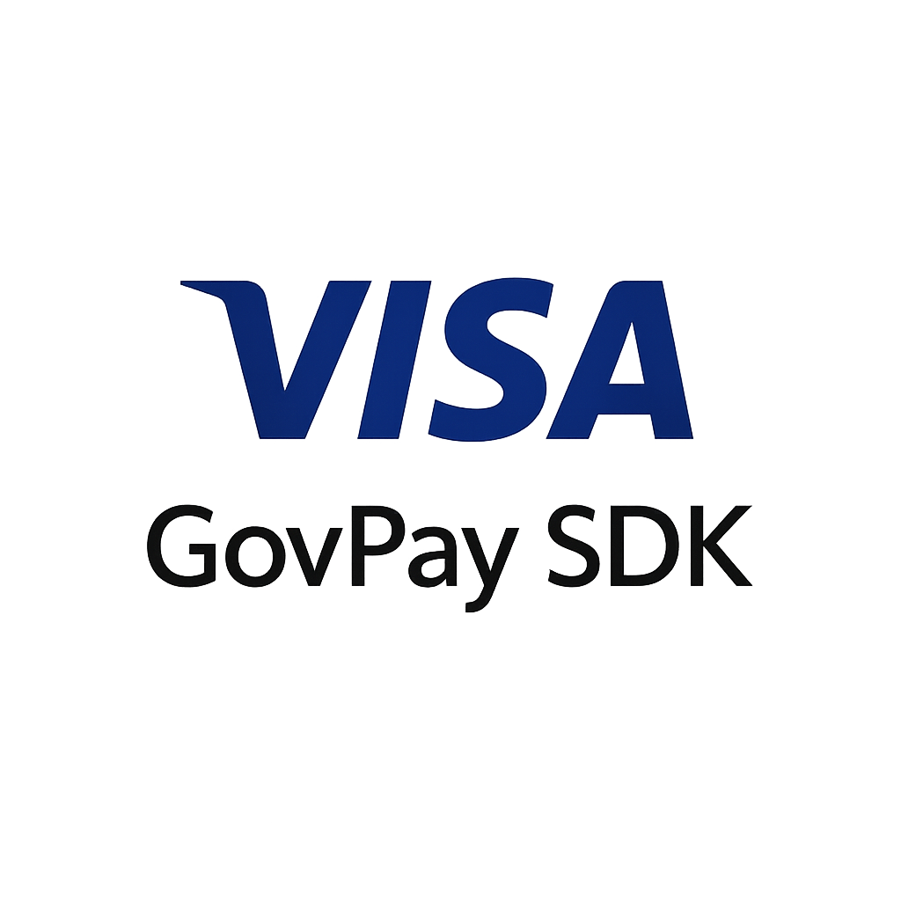

<div align="center">



# vGov — Government Procurement Portal

**AI-powered procurement built on Visa's B2B payment infrastructure**

[](https://nextjs.org)
[](https://www.typescriptlang.org)
[](https://tailwindcss.com)
[](https://developer.visa.com)
[](https://github.com/ericomack1983/vgov-hackathon)

---

> *From RFP to payment — entirely within Visa's ecosystem. No third-party payment rails. No manual card controls. No MCC lookup tables.*

---

</div>

## Table of Contents

- [Overview](#overview)
- [Live Demo](#live-demo)
- [Architecture](#architecture)
- [Key Features](#key-features)
- [Visa APIs](#visa-apis-used)
- [How IPC Works](#how-ipc-works--intelligent-payment-controls)
- [AI Supplier Matching (VSMS)](#ai-supplier-matching--vsms)
- [Getting Started](#getting-started)
- [Project Structure](#project-structure)

---

## Overview

**vGov** is a full-stack government procurement portal built for the [VGS Hackathon 2026](https://github.com/ericomack1983/vgov-hackathon). It demonstrates how Visa's B2B payment APIs can power an end-to-end procurement lifecycle — from publishing an RFP to issuing a controlled virtual card to a winning supplier.

```
Government officer → publishes RFP → AI scores suppliers → issues VCN → applies IPC rules → payment settled
```

Every payment control, every virtual card, every supplier score runs through Visa's live sandbox APIs.

---

## Live Demo

> Start the dev server and explore three roles:

```bash
npm run dev
# → http://localhost:3000
```

| Role | Access | Description |
|---|---|---|
| **Gov** | Full access | Create RFPs, issue VCNs, manage budgets |
| **Supplier** | Bid portal | Submit proposals, view payment status |
| **Auditor** | Read-only | Reconciliation, transaction logs, audit trail |

---

## Architecture

```
┌─────────────────────────────────────────────────────────────────┐
│                         vGov Portal                             │
│                                                                 │
│  ┌──────────────┐   ┌──────────────┐   ┌──────────────────┐   │
│  │  RFP Engine  │   │ AI Scoring   │   │  Payment Module  │   │
│  │              │──▶│   (VSMS)     │──▶│                  │   │
│  │ Create / Pub │   │ 6-Dimension  │   │  VCN Issuance    │   │
│  │ Evaluate     │   │ Ranking      │   │  IPC Rules       │   │
│  └──────────────┘   └──────────────┘   └──────────────────┘   │
│                                                │                │
│  ┌──────────────────────────────────────────────────────────┐  │
│  │                     Visa SDK Layer                        │  │
│  │   VCN · VPA · VPC · IPC · VSMS · Reconciliation API      │  │
│  └──────────────────────────────────────────────────────────┘  │
└─────────────────────────────────────────────────────────────────┘
                              │
              ┌───────────────┼───────────────┐
              ▼               ▼               ▼
        Visa Sandbox    AI/ML Models    OAuth 2.0 Gateway
```

---

## Key Features

### Procurement Lifecycle

| Stage | Feature | Visa API |
|---|---|---|
| **1. Request** | Create & publish RFP with budget, requirements, MCC codes | — |
| **2. Score** | AI evaluates all suppliers across 6 weighted dimensions | VSMS |
| **3. Award** | One-click contract issuance to winning supplier | VPA |
| **4. Pay** | Issue single-use virtual card, locked to supplier + amount | VCN |
| **5. Control** | Apply intelligent payment rules from plain-English prompt | IPC / VPC |
| **6. Reconcile** | Full transaction history with audit trail | Reconciliation API |

---

### Financial Dashboard

- **Annual & Monthly Budget Tracker** — live gauge charts with threshold alerts
- **Recurring Contract Commitments** — installment schedule visibility
- **Spend Analytics** — donut charts by category, department, and supplier
- **Real-time Notifications** — payment events, contract milestones, alerts

---

### Virtual Card Issuance (VCN)

```
┌────────────────────────────────────────────────────────┐
│  IPC Panel                    │  Card Issuance Form    │
│                               │                        │
│  Prompt: "electrical parts,   │  Supplier: Acme Corp   │
│  domestic only, $12k cap"     │  Amount:   $12,000     │
│                               │  MCC:      5065        │
│  ────────────────────────     │                        │
│  Rules translated:            │  [ Issue VCN ]         │
│  ✓ SPV  → $12,000 cap         │                        │
│  ✓ MCC  → 5065, 5112          │  ←──── live Visa ────→ │
│  ✓ GEO  → domestic only       │        sandbox call    │
│  ✓ ATM  → blocked             │                        │
│                               │                        │
│  Confidence: 94%              │  VCN: 4111 **** 7832   │
└────────────────────────────────────────────────────────┘
```

The **IPC Panel** animates in real time as you fill in the form — translating plain-English parameters into a `VPCRule[]` list with a confidence score and rationale.

The **issuance overlay** fires the real Visa sandbox call when you click "Issue Virtual Card Number."

> The panel is the explanation. The overlay is the execution.

---

## Visa APIs Used

| API | Full Name | Purpose in vGov |
|---|---|---|
| **VCN** | Virtual Card Network | Issue single-use virtual card credentials tied to a supplier |
| **VPA** | Virtual Payment Accounts | Buyer onboarding, proxy pool management, funding accounts |
| **VPC** | Visa Payment Controls | Enroll cards and apply structured spending rules |
| **IPC** | Intelligent Payment Controls | Translate plain-English intent into `VPCRule[]` via Gen-AI |
| **VSMS** | Visa Supplier Matching Service | Score and rank suppliers across 6 AI-weighted dimensions |

---

## How IPC Works — Intelligent Payment Controls

### The Problem

Configuring payment control rules manually requires knowing rule codes, spending limits, MCC codes, and channel flags. Most procurement officers don't have that expertise — and getting it wrong means either under-constrained cards or blocked legitimate payments.

### The Solution

Describe how the card should be used in plain English. IPC's Gen-AI model translates your intent into a ready-to-apply `VPCRule[]` — with a plain-English rationale and a confidence score.

```ts
// The entire integration — one API call
const { suggestions } = await vpcService.IPC.getSuggestedRules({
  prompt: 'government procurement — electrical parts, domestic only, $12,000 cap',
  currencyCode: '840',
});
await vpcService.IPC.setSuggestedRules(suggestions[0].ruleSetId, accountId);
```

### Request → Response Flow

```
Your App                  Visa API Gateway             IPC Model
   │                            │                          │
   │─── POST /ipc/v1/suggest ──▶│                          │
   │    { prompt, currency }    │─── tokenize + embed ────▶│
   │                            │                          │ classify intent
   │                            │                          │ resolve MCC codes
   │                            │                          │ map → VPC rule schema
   │                            │                          │ score confidence
   │                            │◀── VPCRule[] + score ────│
   │◀── suggestions[] ──────────│                          │
```

### What Gets Extracted

Given `"office supplies, domestic only, $5,000 cap"`:

| Step | Output |
|---|---|
| **Intent tokens** | `spend_category`, `geo_restriction`, `amount_limit` |
| **MCC resolution** | `5065`, `5112`, `5044` |
| **Rule primitives** | `SPV` (cap), `MCC_RESTRICT` (category), `GEO_BLOCK` (domestic), `ATM_BLOCK` (default) |
| **Confidence** | ~70% vague → ~94% precise prompt |
| **Rationale** | Plain-English explanation of translation decisions |

### IPC vs General-Purpose LLM

| | General-Purpose LLM | Visa IPC Model |
|---|---|---|
| **Output** | Free-form text | Structured `VPCRule[]` — schema-validated |
| **Parsing** | You parse / interpret | Apply `ruleSetId` directly to a card |
| **Domain** | No payment grounding | Trained on VPC ontology, MCC taxonomy, Visa policy |
| **Hallucination** | Rule codes can be invented | Only emits known, valid rule types |
| **Auth** | Your API key | Authenticated via Visa OAuth token |

### What You Don't Need to Build

```
✗  No OpenAI / Anthropic API key
✗  No prompt engineering for rule formatting
✗  No JSON parsing of free-form text
✗  No rule validation logic
✗  No MCC code lookup tables
✓  One REST call. Visa does the rest.
```

---

## AI Supplier Matching — VSMS

The **Visa Supplier Matching Service** scores every supplier response to an RFP across six weighted dimensions.

```
┌─────────────────────────────────────────────────────────────────┐
│  VSMS Evaluation — Supplier: Acme Electrical Supply             │
│                                                                 │
│  ● Financial Stability    ████████████████░░░░  82 / 100       │
│  ● Compliance & Licensing ███████████████████░  94 / 100       │
│  ● Past Performance       ██████████████░░░░░░  71 / 100       │
│  ● Pricing Competitiveness████████████████░░░░  80 / 100       │
│  ● Delivery Capability    ███████████████████░  95 / 100       │
│  ● ESG & Sustainability   ████████████░░░░░░░░  62 / 100       │
│                                                                 │
│  Composite Score: 88 / 100  ▲  Ranked #1 of 6 suppliers        │
└─────────────────────────────────────────────────────────────────┘
```

Each score links to an explainability panel showing why each dimension was rated — building auditor trust and procurement accountability.

---

## Getting Started

### Prerequisites

- Node.js 18+
- npm 9+

### Install & Run

```bash
# Clone the repository
git clone https://github.com/ericomack1983/vgov-hackathon.git
cd vgov-hackathon

# Install dependencies
npm install

# Start development server
npm run dev
```

Open [http://localhost:3000](http://localhost:3000)

### Build for Production

```bash
npm run build
npm start
```

---

## Project Structure

```
src/
├── app/                    # Next.js App Router pages
│   ├── dashboard/          # Financial dashboard & budget tracker
│   ├── rfp/                # RFP creation, evaluation, award
│   ├── suppliers/          # Supplier directory & VSMS scoring
│   ├── cards/              # VCN issuance + IPC panel
│   ├── payment/            # Payment execution flow
│   ├── reconciliation/     # Transaction reconciliation
│   ├── invoice/            # Invoice management
│   ├── notifications/      # Real-time event feed
│   └── sdk-logs/           # Live Visa SDK call inspector
│
├── components/
│   ├── ai/                 # VSMS scoring UI, explainability panels
│   ├── dashboard/          # Budget gauges, donut charts, contracts
│   ├── layout/             # Sidebar, navigation
│   ├── procurement/        # RFP forms, invoice overlays
│   └── ui/                 # Shared components, glow effects
│
├── context/                # App state — payments, sidebar, providers
├── lib/
│   ├── ai-engine.ts        # VSMS scoring engine
│   ├── visa-sdk.ts         # Visa API client wrapper
│   ├── sdk-logger.ts       # Live SDK call logging
│   └── mock-data/          # Sandbox-compatible data fixtures
```

---

<div align="center">

Built for the **VGS Hackathon 2026** · Powered by **Visa B2B APIs**

[](https://github.com/ericomack1983/vgov-hackathon)

</div>
